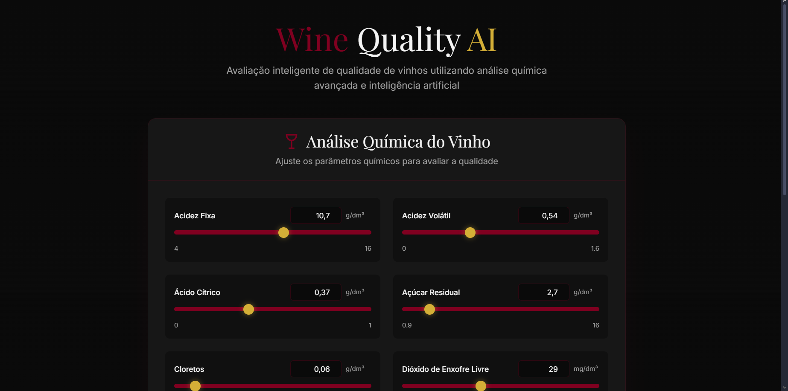
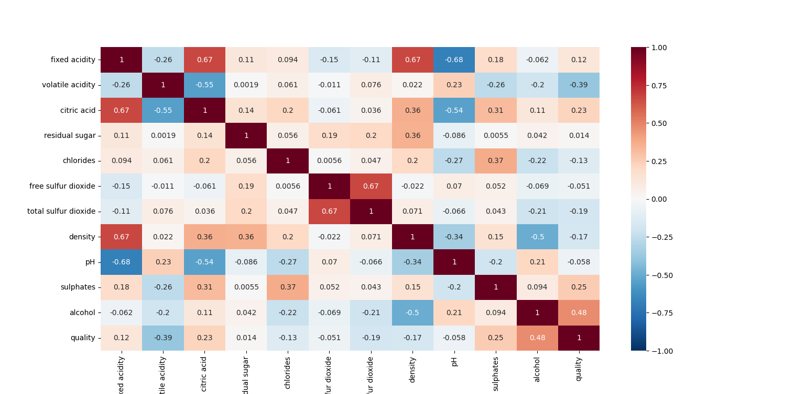

# 🍷 Wine Quality Predictor: Do Dados ao Deploy


-purple)

> **Uma aplicação Full Stack de Data Science capaz de prever a qualidade de vinhos tintos com base em propriedades físico-químicas.**

---

## 🖼️ Demonstração da Aplicação

### Interface Principal e Resultado
Abaixo, a tela inicial do sistema e o resultado da análise via inteligência artificial.

| Tela Inicial do Formulário | Resultado da Previsão (Modal) |
| :---: | :---: |
|  |  |

---

## 💡 Sobre o Projeto

Este projeto foi desenvolvido como um marco na minha jornada de aprendizado em Engenharia de Dados e Machine Learning. O objetivo principal foi ir além da teoria e construir um **pipeline completo**: começando na análise exploratória bruta, passando pelo treinamento de modelos e finalizando com a entrega de valor através de uma aplicação web utilizável.

Embora seja um projeto de portfólio inicial, ele simula um cenário real de mercado onde o modelo não vive apenas no notebook, mas serve a uma aplicação final.

### Diferenciais Técnicos
* **Análise Estatística Rigorosa:** Tratamento de outliers com método de Tukey e análise de correlação (Heatmaps/Jointplots).
* **Engenharia de Machine Learning:** Persistência do modelo treinado (`.pkl`) e padronização de dados (`StandardScaler`) para garantir consistência entre treino e produção.
* **API Profissional:** Construção de uma API RESTful com **FastAPI** e validação de dados com **Pydantic**.
* **Vibe Coding / AI-Assisted Dev:** O frontend foi desenvolvido utilizando técnicas modernas de "Vibe Coding" (via v0.dev), demonstrando capacidade de integrar ferramentas de IA Generativa para acelerar o desenvolvimento de interfaces complexas.

---

## ⚙️ Arquitetura e Tecnologias

O projeto está estruturado em três camadas principais:

1.  **Data Science & Training (`main.py`)**:
    * **Pandas & Numpy:** Manipulação e limpeza de dados.
    * **Seaborn & Matplotlib:** Visualização e EDA (Exploratory Data Analysis).
    * **Scikit-Learn:** Treinamento do modelo (Random Forest Classifier) e métricas de avaliação.
    * **Joblib:** Serialização do modelo.

2.  **Backend & API (`app.py`)**:
    * **FastAPI:** Servidor de alta performance para expor o modelo.
    * **CORS Middleware:** Configuração de segurança para comunicação com o frontend.

3.  **Frontend (`index.html`)**:
    * **HTML5 & Tailwind CSS:** Interface responsiva e elegante (Dark Mode).
    * **Vanilla JavaScript:** Consumo assíncrono da API via `fetch`.

---

## 📊 Análise de Dados (EDA)

Antes do treinamento, os dados passaram por um processo rigoroso de análise para entender as correlações químicas que influenciam a qualidade do vinho.


*Matriz de correlação utilizada para seleção de features.*

---

## 🚀 Como Executar o Projeto

Siga os passos abaixo para rodar a aplicação no seu ambiente local.

### Pré-requisitos
* Python 3.8+
* Git

### Passo a Passo

1.  **Clone o repositório**
    ```bash
    git clone [https://github.com/tlsmrtns/previsao-qualidade-vinho.git](https://github.com/tlsmrtns/previsao-qualidade-vinho.git)
    cd previsao-qualidade-vinho
    ```

2.  **Crie e ative um ambiente virtual**
    ```bash
    # Windows
    python -m venv venv
    .\venv\Scripts\activate

    # Linux/Mac
    python3 -m venv venv
    source venv/bin/activate
    ```

3.  **Instale as dependências**
    ```bash
    pip install -r requirements.txt
    ```

4.  **Treine o Modelo**
    Execute o script principal para processar os dados, treinar o Random Forest e gerar os arquivos `.pkl`.
    ```bash
    python main.py
    ```
    *Você verá relatórios de acurácia e gráficos estatísticos.*

5.  **Inicie a API**
    Suba o servidor local com o Uvicorn.
    ```bash
    uvicorn app:app --reload
    ```

6.  **Acesse a Aplicação**
    Abra o arquivo `index.html` diretamente no seu navegador.

---

## 🤝 Créditos e Referências

Este projeto foi desenvolvido para fins educacionais, utilizando dados públicos e referências da comunidade:

* **Dataset:** [Wine Quality Data Set](https://archive.ics.uci.edu/ml/datasets/wine+quality) (UCI Machine Learning Repository).
* **Inspiração:** Tutorial *Using Data Science to Understand What Makes Wine Taste Good* (FreeCodeCamp).
* **Desenvolvimento:** Código modernizado através da aplicação de princípios de Clean Code e refatoração para adequação às melhores práticas de Engenharia de Software.

---

**Desenvolvido por [Tales Martins](https://github.com/tlsmrtns)**
*Graduando em Engenharia e Entusiasta de Data Science*